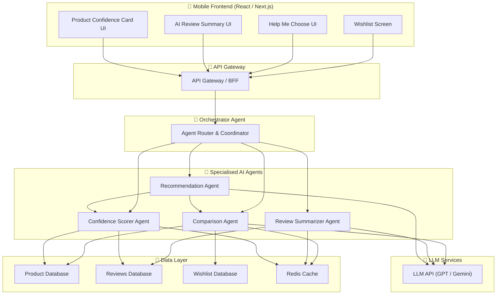
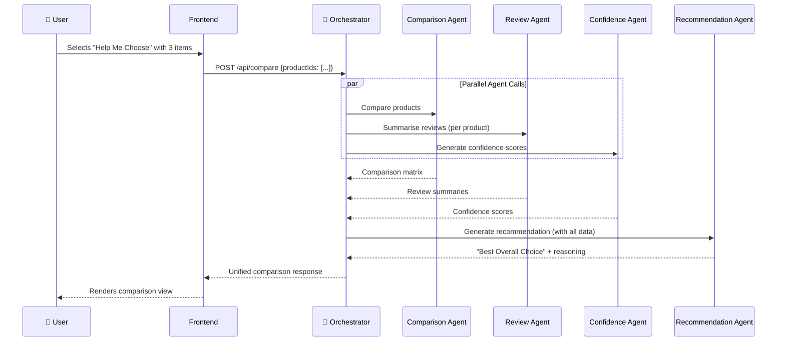
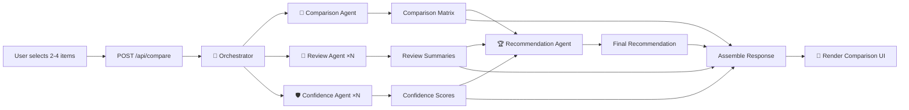
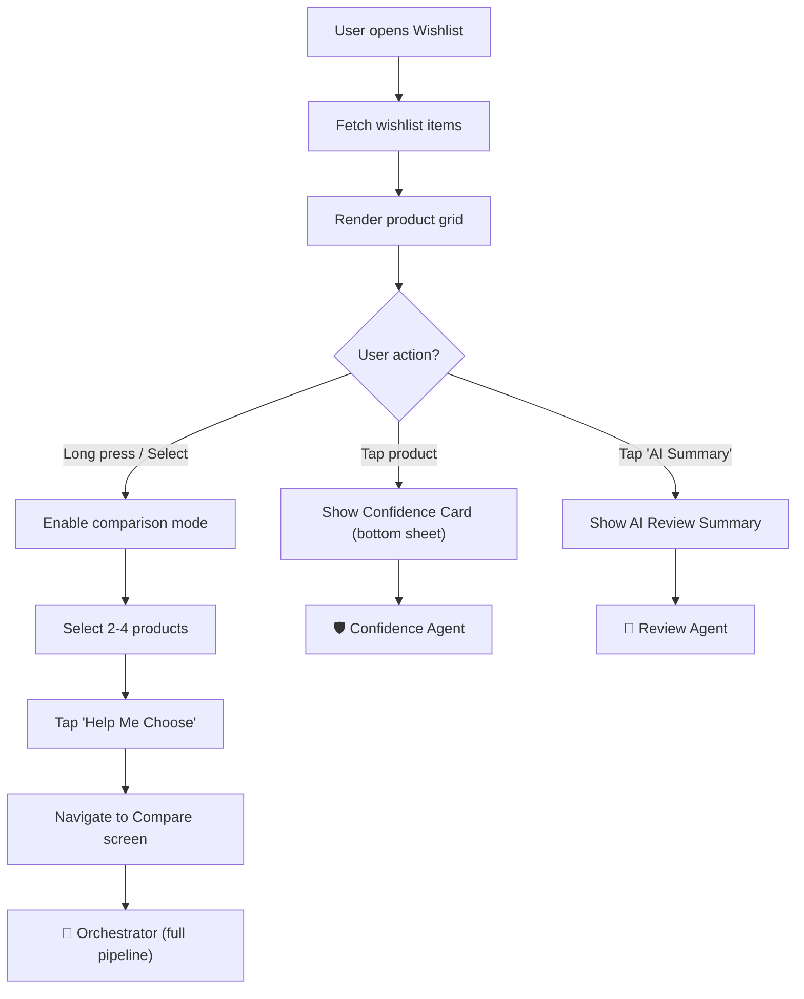

# Myntra Wishlist Decision Assistant — Architecture Document

> **Reference**: [problemStatement.md](file:///d:/MYNTRA_WISHLIST_MVP/problemStatement.md)

---

## 1. System Overview

The Myntra Wishlist Decision Assistant is a **multi-agentic AI system** designed to help high-intent fashion shoppers convert wishlisted items into purchases. The system uses specialised AI agents that collaborate through an orchestrator to deliver three core features:

1. **Help Me Choose** — AI Wishlist Comparator
2. **AI Review Summary** — Structured review intelligence
3. **Product Confidence Card** — At-a-glance purchase readiness



---

## 2. Multi-Agent Architecture

### 2.1 Agent Design Principles

| Principle | Description |
|---|---|
| **Single Responsibility** | Each agent owns one well-defined domain (comparison, reviews, scoring) |
| **Composability** | Agents can be combined by the orchestrator for complex workflows |
| **Statelessness** | Agents are stateless; all state is persisted in the data layer |
| **Cacheable** | Agent outputs are cached with TTLs to avoid redundant LLM calls |
| **Observable** | Every agent emits structured logs, latency metrics, and confidence scores |

---

### 2.2 Agent Definitions

#### 🧠 Orchestrator Agent

The central coordinator that receives user requests, decomposes them into sub-tasks, dispatches to specialised agents, and assembles the final response.

| Property | Detail |
|---|---|
| **Role** | Request routing, agent coordination, response assembly |
| **Input** | User action (compare, view summary, view confidence card) |
| **Output** | Unified response payload for the frontend |
| **Concurrency** | Parallelises independent agent calls (e.g., reviews + product data) |

**Responsibilities:**
- Parse incoming request type and extract product IDs
- Determine which agents to invoke (and in what order)
- Fan-out parallel calls where possible
- Merge agent responses into a single frontend-ready payload
- Handle agent failures with graceful fallbacks



---

#### 🔄 Comparison Agent

Handles the **Help Me Choose** feature. Fetches and normalises product attributes for side-by-side comparison.

| Property | Detail |
|---|---|
| **Input** | 2–4 product IDs from the user's wishlist |
| **Output** | Structured comparison matrix with normalised scores |
| **Data Sources** | Product DB, Wishlist DB, Pricing API |

**Comparison Dimensions:**

```json
{
  "dimensions": [
    { "key": "price", "type": "numeric", "sort": "asc", "weight": 0.15 },
    { "key": "rating", "type": "numeric", "sort": "desc", "weight": 0.15 },
    { "key": "sizeAvailability", "type": "percentage", "sort": "desc", "weight": 0.10 },
    { "key": "fitScore", "type": "sentiment", "sort": "desc", "weight": 0.15 },
    { "key": "qualityScore", "type": "sentiment", "sort": "desc", "weight": 0.15 },
    { "key": "customerPhotosCount", "type": "numeric", "sort": "desc", "weight": 0.05 },
    { "key": "deliveryDays", "type": "numeric", "sort": "asc", "weight": 0.10 },
    { "key": "returnWindow", "type": "numeric", "sort": "desc", "weight": 0.05 },
    { "key": "discountPercent", "type": "numeric", "sort": "desc", "weight": 0.10 }
  ]
}
```

---

#### 📝 Review Summarizer Agent

Powers the **AI Review Summary** feature. Ingests raw reviews and produces structured, trustworthy summaries.

| Property | Detail |
|---|---|
| **Input** | Product ID, raw reviews (verified only) |
| **Output** | Structured summary with category-level insights |
| **LLM Usage** | Summarisation with citation linking |

**Output Schema:**

```json
{
  "productId": "SKU123",
  "totalReviewsAnalysed": 342,
  "overallSentiment": "positive",
  "categories": {
    "fit": { "summary": "Runs slightly large...", "sentiment": "neutral", "confidence": 0.87, "reviewIds": ["r1", "r5", "r12"] },
    "quality": { "summary": "Good fabric quality...", "sentiment": "positive", "confidence": 0.92, "reviewIds": ["r2", "r8"] },
    "colourAccuracy": { "summary": "Colour matches photos...", "sentiment": "positive", "confidence": 0.78, "reviewIds": ["r3", "r7"] },
    "fabric": { "summary": "Soft cotton blend...", "sentiment": "positive", "confidence": 0.85, "reviewIds": ["r4", "r9"] },
    "valueForMoney": { "summary": "Worth the price...", "sentiment": "positive", "confidence": 0.80, "reviewIds": ["r6", "r11"] },
    "commonComplaints": { "summary": "Some users reported...", "sentiment": "negative", "confidence": 0.75, "reviewIds": ["r10", "r13"] }
  },
  "linkedReviews": { "r1": { "text": "...", "rating": 4, "verified": true }, "..." : "..." }
}
```

> [!IMPORTANT]
> The `reviewIds` array in each category links back to `linkedReviews`, enabling the "Show actual reviews" trust feature required in the problem statement.

---

#### 🛡️ Confidence Scorer Agent

Generates the **Product Confidence Card** data by aggregating signals from multiple sources into a unified confidence profile.

| Property | Detail |
|---|---|
| **Input** | Product ID |
| **Output** | Confidence card payload with all 10 attributes |
| **Logic** | Rule-based scoring + sentiment analysis |

**Scoring Model:**

```
Confidence Score = Σ (dimension_score × weight)

Dimensions:
├── Rating Quality     (weight: 0.15) — avg rating + review count factor
├── Review Trust       (weight: 0.15) — verified ratio + photo count
├── Fit Clarity        (weight: 0.15) — fit feedback consensus
├── Quality Sentiment  (weight: 0.15) — NLP sentiment on quality mentions
├── Colour Accuracy    (weight: 0.10) — colour-related review sentiment
├── Size Availability  (weight: 0.10) — % of sizes in stock
├── Delivery Speed     (weight: 0.08) — days to deliver
├── Return Friendliness(weight: 0.07) — return window + ease
└── Price Value        (weight: 0.05) — discount + price vs category avg
```

**Output:**
- **Confidence Score**: 0–100 (mapped to label: Low / Medium / High / Very High)
- **Confidence Breakdown**: Per-dimension scores
- **Highlights**: Top 3 strengths + Top concern

---

#### 🏆 Recommendation Agent

Synthesises outputs from the Comparison and Confidence agents to produce the **"Best Overall Choice"** recommendation with natural-language reasoning.

| Property | Detail |
|---|---|
| **Input** | Comparison matrix + confidence scores for all compared items |
| **Output** | Winner product ID + reasoning text |
| **LLM Usage** | Generates human-readable recommendation explanation |

**Prompt Template (simplified):**
```
You are a fashion shopping advisor for Myntra. Given the following comparison
data for {n} products, recommend the best overall choice.

Consider: price, rating, fit feedback, quality, size availability, delivery
speed, return policy, and discounts.

Comparison Data: {comparison_matrix}
Confidence Scores: {confidence_scores}

Respond with:
1. The best product and why (2-3 sentences, conversational tone)
2. A runner-up mention if the margin is close
3. Any caveats the user should consider
```

---

## 3. Tech Stack

### 3.1 Frontend

| Layer | Technology | Rationale |
|---|---|---|
| **Framework** | Next.js 14+ (App Router) | SSR, file-based routing, React Server Components |
| **Language** | TypeScript | Type safety across agent payloads |
| **Styling** | Vanilla CSS + CSS Modules | Clean, maintainable, no framework lock-in |
| **State Management** | React Context + `useReducer` | Lightweight; no Redux overhead for mobile-first UI |
| **Animations** | Framer Motion | Smooth micro-animations, gesture support |
| **Icons** | Lucide React | Lightweight, consistent icon set |
| **Fonts** | Google Fonts (Outfit, Inter) | Modern, clean typography for fashion UI |

### 3.2 Backend

| Layer | Technology | Rationale |
|---|---|---|
| **Runtime** | Node.js 20+ | JavaScript ecosystem, async I/O for agent calls |
| **API Framework** | Next.js API Routes / Route Handlers | Co-located with frontend, serverless-ready |
| **Agent Framework** | LangChain.js / Custom Agent SDK | Agent orchestration, tool calling, chaining |
| **LLM Provider** | Google Gemini API / OpenAI API | Review summarisation, recommendation generation |
| **Caching** | Redis (or in-memory for MVP) | Cache agent outputs, reduce LLM cost |
| **Database** | PostgreSQL (or mock JSON for MVP) | Product, review, and wishlist data |
| **Validation** | Zod | Runtime schema validation for agent I/O |

### 3.3 Infrastructure (Production Path)

| Layer | Technology |
|---|---|
| **Hosting** | Vercel / Google Cloud Run |
| **CDN** | Vercel Edge / Cloudflare |
| **Monitoring** | OpenTelemetry + Grafana |
| **CI/CD** | GitHub Actions |

---

## 4. Project Structure

```
MYNTRA_WISHLIST_MVP/
├── problemStatement.md
├── architecture.md
├── package.json
├── next.config.js
├── tsconfig.json
│
├── public/
│   └── images/                    # Product images, icons
│
├── src/
│   ├── app/                       # Next.js App Router
│   │   ├── layout.tsx             # Root layout (fonts, global styles)
│   │   ├── page.tsx               # Entry → redirects to /wishlist
│   │   ├── globals.css            # Design system tokens & base styles
│   │   │
│   │   ├── wishlist/
│   │   │   └── page.tsx           # Wishlist screen
│   │   │
│   │   ├── compare/
│   │   │   └── page.tsx           # Help Me Choose comparison view
│   │   │
│   │   └── api/
│   │       ├── compare/
│   │       │   └── route.ts       # POST /api/compare
│   │       ├── review-summary/
│   │       │   └── route.ts       # GET /api/review-summary/:productId
│   │       ├── confidence-card/
│   │       │   └── route.ts       # GET /api/confidence-card/:productId
│   │       └── wishlist/
│   │           └── route.ts       # GET /api/wishlist
│   │
│   ├── components/
│   │   ├── ui/                    # Reusable primitives
│   │   │   ├── Button.tsx
│   │   │   ├── Card.tsx
│   │   │   ├── Badge.tsx
│   │   │   ├── ProgressBar.tsx
│   │   │   ├── Skeleton.tsx
│   │   │   └── BottomSheet.tsx
│   │   │
│   │   ├── wishlist/
│   │   │   ├── WishlistGrid.tsx           # Product grid with selection
│   │   │   ├── WishlistItem.tsx           # Individual product card
│   │   │   └── CompareFloatingBar.tsx     # "Compare N items" sticky bar
│   │   │
│   │   ├── compare/
│   │   │   ├── ComparisonTable.tsx        # Side-by-side comparison
│   │   │   ├── ComparisonDimension.tsx    # Single comparison row
│   │   │   ├── WinnerBadge.tsx            # "Best Overall" badge
│   │   │   └── RecommendationCard.tsx     # AI recommendation section
│   │   │
│   │   ├── reviews/
│   │   │   ├── AIReviewSummary.tsx        # Summarised review card
│   │   │   ├── ReviewCategory.tsx         # Single category (fit, quality...)
│   │   │   ├── ReviewSourceList.tsx       # "See actual reviews" drawer
│   │   │   └── SentimentIndicator.tsx     # Visual sentiment display
│   │   │
│   │   └── confidence/
│   │       ├── ConfidenceCard.tsx          # The full confidence card
│   │       ├── ConfidenceScore.tsx         # Circular score display
│   │       ├── ConfidenceBreakdown.tsx     # Per-dimension breakdown
│   │       └── ConfidenceHighlights.tsx    # Strengths & concerns
│   │
│   ├── agents/                    # Multi-Agent System
│   │   ├── orchestrator.ts        # 🧠 Orchestrator Agent
│   │   ├── comparisonAgent.ts     # 🔄 Comparison Agent
│   │   ├── reviewAgent.ts         # 📝 Review Summarizer Agent
│   │   ├── confidenceAgent.ts     # 🛡️ Confidence Scorer Agent
│   │   ├── recommendationAgent.ts # 🏆 Recommendation Agent
│   │   └── types.ts               # Shared agent I/O types
│   │
│   ├── lib/
│   │   ├── llm.ts                 # LLM client initialisation
│   │   ├── cache.ts               # Caching utilities
│   │   ├── prompts.ts             # All LLM prompt templates
│   │   └── scoring.ts             # Scoring & normalisation utilities
│   │
│   ├── data/                      # Mock data for MVP
│   │   ├── products.json          # 10-15 mock fashion products
│   │   ├── reviews.json           # Mock reviews per product
│   │   └── wishlist.json          # Default user wishlist
│   │
│   ├── hooks/
│   │   ├── useWishlist.ts         # Wishlist state management
│   │   ├── useCompare.ts          # Comparison selection logic
│   │   ├── useReviewSummary.ts    # Fetch & cache review summaries
│   │   └── useConfidenceCard.ts   # Fetch & cache confidence cards
│   │
│   └── types/
│       ├── product.ts             # Product types
│       ├── review.ts              # Review types
│       ├── comparison.ts          # Comparison result types
│       ├── confidence.ts          # Confidence card types
│       └── agent.ts               # Agent request/response types
│
└── tests/
    ├── agents/                    # Agent unit tests
    └── components/                # Component tests
```

---

## 5. API Design

### 5.1 Endpoints

#### `GET /api/wishlist`
Returns the user's wishlisted products with basic info.

```json
{
  "items": [
    {
      "id": "SKU123",
      "name": "Floral Maxi Dress",
      "brand": "Anouk",
      "price": 1499,
      "originalPrice": 2999,
      "discount": 50,
      "rating": 4.2,
      "reviewCount": 342,
      "image": "/images/product1.jpg",
      "sizes": ["S", "M", "L", "XL"],
      "inStock": true
    }
  ]
}
```

#### `POST /api/compare`
Triggers the Help Me Choose multi-agent pipeline.

**Request:**
```json
{
  "productIds": ["SKU123", "SKU456", "SKU789"]
}
```

**Response:**
```json
{
  "comparison": { "...comparison matrix..." },
  "reviewSummaries": { "SKU123": { "..." }, "SKU456": { "..." } },
  "confidenceScores": { "SKU123": 82, "SKU456": 75 },
  "recommendation": {
    "winnerId": "SKU123",
    "label": "Best Overall Choice",
    "reasoning": "The Floral Maxi Dress scores highest for quality and fit...",
    "runnerUp": { "id": "SKU456", "note": "Better price but lower quality score" }
  }
}
```

#### `GET /api/review-summary/[productId]`
Returns the AI-generated review summary for a single product.

#### `GET /api/confidence-card/[productId]`
Returns the confidence card data for a single product.

---

## 6. Data Flow — End-to-End

### 6.1 Help Me Choose Flow



### 6.2 Wishlist Screen Flow



---

## 7. Agent Communication Protocol

### 7.1 Message Format

All agents communicate using a standardised message envelope:

```typescript
interface AgentMessage<T = unknown> {
  // Metadata
  requestId: string;          // Unique per user request
  agentId: string;            // Source agent identifier
  timestamp: number;          // Unix timestamp
  
  // Payload
  type: 'REQUEST' | 'RESPONSE' | 'ERROR';
  payload: T;
  
  // Observability
  latencyMs?: number;
  confidenceScore?: number;   // 0-1, how confident the agent is
  cacheHit?: boolean;
  tokensUsed?: number;        // LLM token count (if applicable)
}
```

### 7.2 Error Handling & Fallbacks

| Scenario | Fallback Strategy |
|---|---|
| LLM timeout / rate limit | Return cached summary if available; else show "Summary unavailable" |
| Review Agent fails | Show raw top-5 reviews instead of AI summary |
| Confidence Agent fails | Show basic product info without confidence score |
| Comparison Agent partial failure | Compare available data; mark missing dimensions as "N/A" |
| Recommendation Agent fails | Show comparison table without recommendation label |

---

## 8. Caching Strategy

| Data | Cache Key | TTL | Invalidation |
|---|---|---|---|
| Review Summary | `review-summary:{productId}` | 24 hours | New reviews added |
| Confidence Card | `confidence:{productId}` | 6 hours | Price/stock changes |
| Comparison Result | `compare:{sorted-productIds-hash}` | 1 hour | Any product data changes |
| Recommendation | `recommend:{sorted-productIds-hash}` | 1 hour | Tied to comparison cache |
| Product Data | `product:{productId}` | 15 minutes | Real-time for price/stock |

---

## 9. Frontend Screen Specifications

### 9.1 Wishlist Screen
- Mobile-first grid layout (2 columns)
- Product cards show: image, name, brand, price, discount badge, rating
- **Tap** → opens Confidence Card as bottom sheet
- **Long press** or checkbox → enters comparison selection mode
- Floating action bar appears when 2+ items selected: "Help Me Choose (N)"
- Entry point to AI Review Summary via icon on each card

### 9.2 Help Me Choose (Comparison) Screen
- Horizontal scroll for 2–4 products
- Vertical dimension rows: Price, Rating, Fit, Quality, etc.
- **Winner highlighting** per dimension (green tint on best value)
- **"Best Overall Choice"** badge on recommended product
- AI recommendation card at bottom with natural language explanation
- "Add to Bag" CTA on winner product

### 9.3 AI Review Summary (Bottom Sheet / Inline)
- Category cards: Fit, Quality, Colour Accuracy, Fabric, Value, Complaints
- Each card shows: sentiment icon + 1-2 line summary
- "Based on N verified reviews" trust badge
- Expandable "See reviews" section per category → shows linked original reviews

### 9.4 Product Confidence Card (Bottom Sheet)
- Circular confidence score (0–100) with colour coding
- Grid of quick-glance attributes (10 items from problem statement)
- Top 3 strengths highlighted in green
- Top concern highlighted in amber/red
- "Add to Bag" CTA

---

## 10. Design System Tokens

```css
/* Colour Palette */
--color-primary: #FF3E6C;           /* Myntra Pink */
--color-primary-dark: #E0355F;
--color-secondary: #FF7B54;          /* Warm accent */
--color-bg-primary: #FAFAFA;
--color-bg-card: #FFFFFF;
--color-bg-dark: #1A1A2E;
--color-text-primary: #282C3F;
--color-text-secondary: #94969F;
--color-success: #14C38E;
--color-warning: #F5A623;
--color-danger: #FF4444;
--color-info: #5C7AFF;

/* Typography */
--font-primary: 'Outfit', sans-serif;
--font-secondary: 'Inter', sans-serif;

/* Spacing */
--space-xs: 4px;
--space-sm: 8px;
--space-md: 16px;
--space-lg: 24px;
--space-xl: 32px;
--space-2xl: 48px;

/* Borders & Radius */
--radius-sm: 8px;
--radius-md: 12px;
--radius-lg: 16px;
--radius-full: 999px;

/* Shadows */
--shadow-card: 0 2px 12px rgba(0, 0, 0, 0.06);
--shadow-elevated: 0 8px 24px rgba(0, 0, 0, 0.12);
--shadow-bottom-sheet: 0 -4px 24px rgba(0, 0, 0, 0.1);

/* Transitions */
--transition-fast: 150ms ease;
--transition-base: 250ms ease;
--transition-slow: 400ms ease;
```

---

## 11. MVP Scope & Phasing

### Phase 1 — MVP (Current Sprint)
- [ ] Mock product and review data (JSON files)
- [ ] Wishlist screen with selection mode
- [ ] Comparison Agent with basic scoring
- [ ] Review Summarizer Agent (mock LLM responses for MVP)
- [ ] Confidence Scorer Agent (rule-based)
- [ ] Recommendation Agent with template-based output
- [ ] All three UI features functional end-to-end
- [ ] Mobile-responsive, Myntra-styled UI

### Phase 2 — AI Integration
- [ ] Connect real LLM API (Gemini / OpenAI) for review summarisation
- [ ] LLM-powered recommendation reasoning
- [ ] Redis caching layer
- [ ] Agent observability (latency, token usage, confidence tracking)

### Phase 3 — Production Readiness
- [ ] Real product data integration via Myntra APIs
- [ ] User authentication & personalised wishlists
- [ ] A/B testing framework for conversion metrics
- [ ] Performance optimisation (edge caching, streaming responses)
- [ ] Analytics pipeline for Wishlist → Add-to-Bag conversion tracking

---

## 12. Metrics & Observability

### 12.1 Product Metrics (from Problem Statement)

| Metric | Measurement |
|---|---|
| **Wishlist → Add-to-Bag Conversion** | `(Add-to-Bag events from wishlist) / (Wishlist views)` |
| **30-Day Wishlist → Purchase Conversion** | `(Purchases of wishlisted items within 30d) / (Items wishlisted)` |
| **Return Rate** (guardrail) | `(Returns of decision-assisted purchases) / (Total decision-assisted purchases)` |
| **Cancellation Rate** (guardrail) | `(Cancellations of decision-assisted orders) / (Total decision-assisted orders)` |

### 12.2 Agent Metrics

| Metric | Target |
|---|---|
| Orchestrator E2E latency (P95) | < 3 seconds |
| Individual agent latency (P95) | < 1.5 seconds |
| LLM cache hit rate | > 60% |
| Agent error rate | < 1% |
| Confidence score accuracy | Validated via user feedback loops |

---

## 13. Security Considerations

| Concern | Mitigation |
|---|---|
| LLM prompt injection via reviews | Sanitise all user-generated content before passing to LLM |
| API rate limiting | Rate limit per user on comparison and summary endpoints |
| Data privacy | No PII sent to LLM; only anonymised review text |
| Agent output validation | Zod schema validation on all agent outputs before rendering |

---

## 14. Key Design Decisions

| Decision | Choice | Rationale |
|---|---|---|
| **Agent framework** | Custom lightweight SDK over heavy framework | MVP simplicity; migrate to LangChain later if needed |
| **LLM provider** | Gemini API (primary) | Cost-effective, good summarisation quality |
| **Frontend framework** | Next.js App Router | SSR for fast initial load, API routes co-located |
| **Caching layer** | In-memory (MVP) → Redis (Phase 2) | Avoid infra complexity in MVP |
| **Mock data for MVP** | JSON files in `/data` | Fast iteration without external dependencies |
| **Mobile-first design** | Myntra is primarily mobile | Aligns with design guidelines in problem statement |
